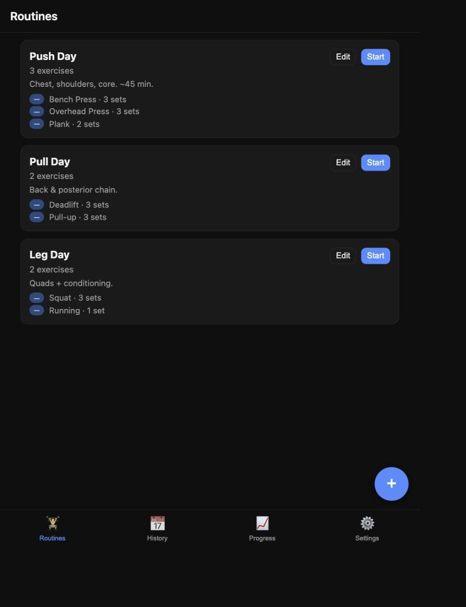
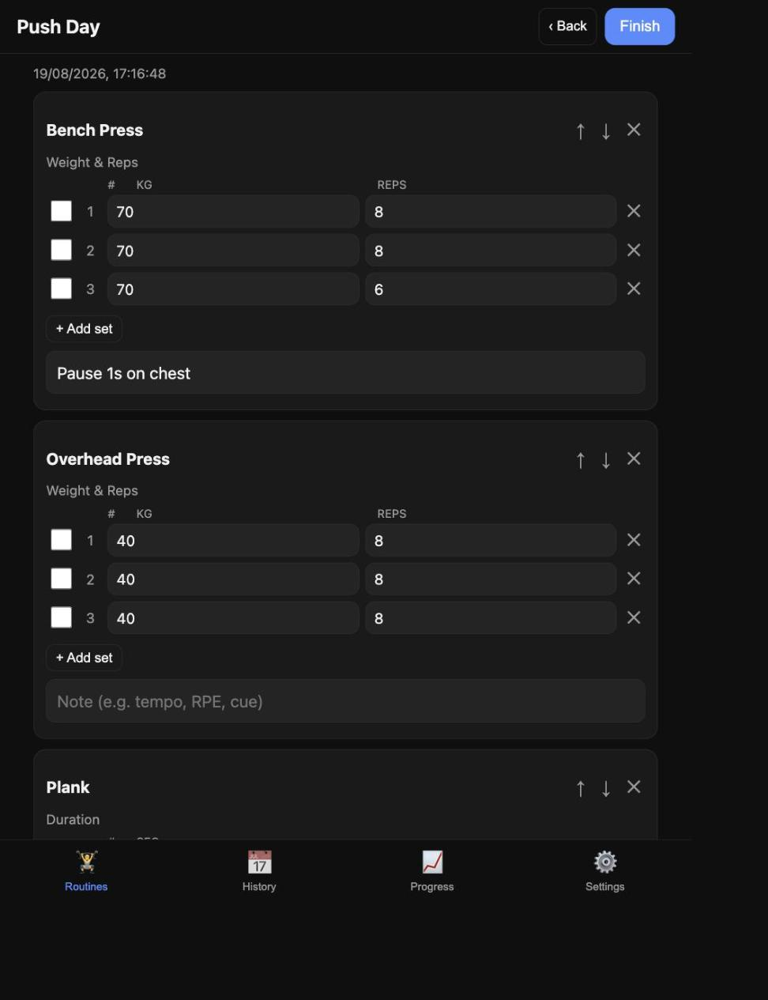
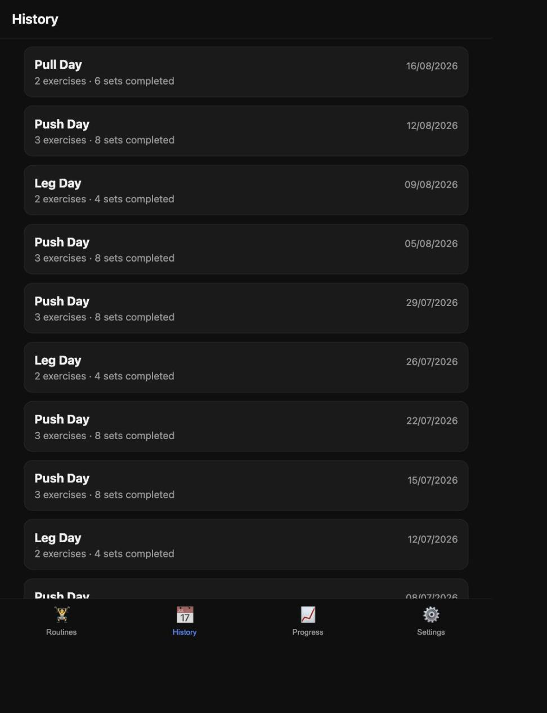
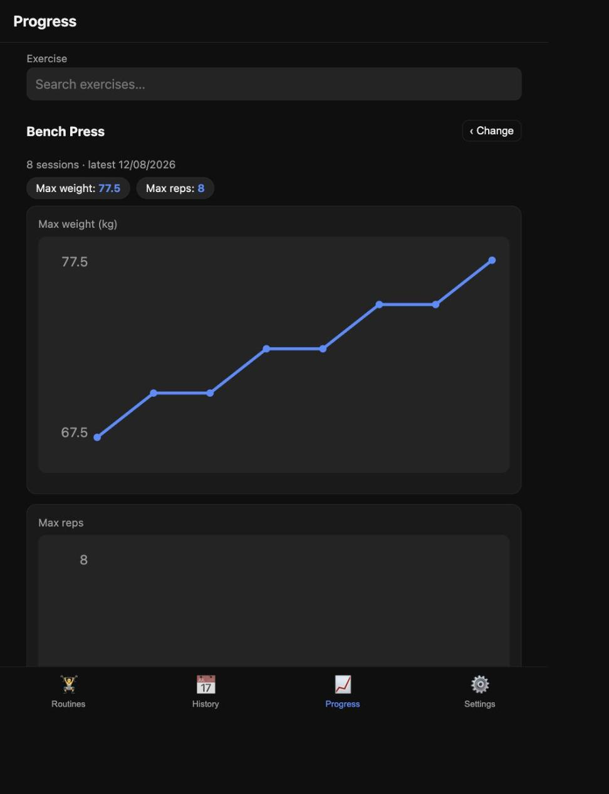

# Fitness Tracker

A self-hosted, Hevy-like personal workout tracker. Create **routines** (exercise
days) with exercises, per-set reps/weight/duration, sets, supersets and notes; **log
workout sessions**; and **track per-exercise progression** over time. Mobile-first
**PWA** frontend backed by a small Node/Express + SQLite server, with **daily JSON
backups to S3** and in-app **export/import**.

No login — meant to run on your own LAN (or reached over a VPN back into it).

> [!WARNING]
> **No authentication.** This app has no login or access control — anyone who can
> reach the port can read and write all data. Run it only on a trusted private
> network (your own LAN, or over a VPN back into it). Do **not** expose it to the
> public internet.
>
> **AI-assisted.** This project was built with AI assistance. Review the code
> before relying on it.

## Screenshots

| Routines | Workout logging |
|:---:|:---:|
|  |  |
| **History** | **Progress** |
|  |  |

## Stack

- **Backend:** Node.js, [Express 5](https://expressjs.com/), [better-sqlite3](https://github.com/WiseLibs/better-sqlite3)
- **Frontend:** Vanilla JS modules, **no build step** — served as static files from `app/`
- **Backups:** `backup.js` dumps `data.sqlite` → JSON → S3, run daily by a systemd timer
- **Infra:** [OpenTofu](https://opentofu.org/) (`tofu/`) provisions the S3 bucket + least-privilege IAM user
- **Task runner:** [just](https://github.com/casey/just) (optional convenience)

## Requirements

- Node.js 18+

## Setup

```bash
npm install
```

The SQLite database (`data.sqlite`) is created automatically on first run and is
gitignored.

**If you have `ignore-scripts=true` in your npm config** (a common hardening
default), `better-sqlite3`'s prebuild step is skipped and you'll hit
`Could not locate the bindings file`. Run once:

```bash
npm rebuild better-sqlite3 --ignore-scripts=false
```

`better-sqlite3` is a native addon — if you develop on a Mac and run on a Raspberry
Pi, don't copy `node_modules`; run `npm install` on the Pi.

## Run

```bash
npm start            # or: just serve
```

Open <http://localhost:3001>. On your phone (same Wi-Fi / VPN), use the server box's
LAN IP: `http://<box-ip>:3001`. To stop a backgrounded server: `just stop`.

The port defaults to **3001** (so it doesn't clash with money-tracker on 3000);
override with `PORT=1234 npm start`. The systemd unit pins `PORT=3001`.

### Run as a systemd service (Linux / Raspberry Pi)

`systemd/fitness-tracker.service` runs the app with `Restart=always`. Edit its
`User`/`WorkingDirectory`/`node` path for your box, then:

```bash
just deploy            # rsync the tree to the `fitness-tracker` SSH alias
# on the server:
just systemd-install
just systemd-enable    # starts the app + the daily backup timer
just systemd-status
```

### Open the firewall (ufw)

If the server runs a firewall (Raspberry Pi OS / Ubuntu commonly use `ufw`), the
app's port is blocked by default and the phone/LAN can't reach it. Open it once on
the server:

```bash
sudo ufw allow 3001/tcp comment 'fitness-tracker app'
sudo ufw reload
sudo ufw status            # confirm 3001/tcp shows ALLOW
```

Restrict it to your LAN subnet instead of the whole world (recommended, since this
has no auth):

```bash
sudo ufw allow from 192.168.1.0/24 to any port 3001 proto tcp comment 'fitness-tracker app'
```

Match the port to whatever the app listens on (`PORT` / the systemd unit — default 3001).

### Updating the server

Push code with `just deploy 'user@host:/path/'`, then — depending on what changed —
do the following **on the server**:

| What changed | After `just deploy` |
|---|---|
| Only `app/` (frontend) | Nothing on the server — files are served fresh per request. Just reload the browser/PWA. |
| `server.js` / dependencies | `just systemd-restart` |
| `systemd/*.service` unit | `just systemd-install` **then** `just systemd-restart` |

Notes:
- `just deploy` only updates the repo copy under `~/fitness-tracker/`. The **live**
  unit lives in `/etc/systemd/system/`, so unit changes need `just systemd-install`
  (which re-copies it and runs `daemon-reload`) before a restart.
- When unsure, `just systemd-restart` is always safe (worst case a no-op restart).
- **Any UI change also needs a browser/PWA reload** for the service worker to swap in
  the new shell — the `sw.js` cache version is bumped on each UI change so the reload
  picks it up (it takes one reload to install the new worker, a second to activate it).

## Backups (S3)

Backups are JSON dumps of the whole database uploaded daily to S3.

1. **Provision infra** (bucket + write-only IAM user) with OpenTofu:
   ```bash
   cp tofu/terraform.tfvars.example tofu/terraform.tfvars   # set a unique bucket_name
   just tofu-init
   just tofu-apply
   ```
2. **Configure credentials** — copy the snippet into `.env`:
   ```bash
   cp .env.example .env
   just tofu-print-env        # prints all but the secret
   just tofu-print-secret     # prints AWS_SECRET_ACCESS_KEY
   ```
3. **Test it:** `just backup` → check `s3://<bucket>/backups/fitness-tracker-<date>.json`.
4. The `fitness-tracker-backup.timer` runs it daily at 02:30 once enabled.

The IAM user can only `s3:PutObject` on `backups/fitness-tracker-*.json`. The bucket
has versioning, encryption, public-access-block, and a lifecycle rule expiring
backups after 90 days.

## Restore / import

Two ways to restore if you lose the local DB:

- **In-app:** Settings → **Import JSON** — pick an exported (or S3-downloaded) backup
  file. This **replaces all current data** (the server copies the current DB to
  `data.sqlite.bak` first).
- **Manual export:** Settings → **Export JSON** downloads a full backup any time.

The in-app export and the S3 backup use the same JSON shape, so either file imports.

## Data model

`exercises` (catalog) → referenced by `routine_exercises` (targets) and, once logged,
snapshotted into `session_exercises` (actuals). Per-set data (reps/weight/duration/
distance) is stored as a JSON array per exercise, so metrics stay flexible. Sessions
snapshot exercise names/types, so renaming or deleting a catalog exercise never
breaks past history. Progression is derived server-side from completed logged sets.

Weights are stored and displayed in **kg**.
